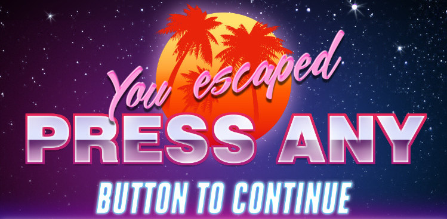

## Maze Escape


[Live Site](https://gkopplin.github.io/maze-escape/)

### Table of Contents
[Backgound](#background)

[Features](#features)

[Functionality and MVPs](#functionality)

[Architecture and Technologies](#architecture)

[Implementation Timeline](#implementation)

[Bonus Features](#bonus)


### <a name="backgound"></a> Background

Maze Escape is a retro, turn-based maze escape game. Each turn, the user moves their character one step, triggering the enemy characters to move one step towards the user. If an enemy character reaches the user, they must restart the level. If the user reaches the exit without being caught by an enemy character, they move onto the next level. 

The key mechanic of the game is that enemy character will not move if a wall blocks its path (the user must be on the same x/y coordinate as the enemy character- the enemy will move if the user is to the side of a wall).

### <a name="features"></a> Features
The following are notable features in Maze Escape. A more comprehensive description of the functionality of the game is below.

### 1. Level Progression
When a user reaches the exit of a level, the Game object hides the HTML Canvas element and shows the root div element (by modifying the classes of each). The appropriate image is also pushed into the inner HTML of the root element. A DOM keypress event listener is added to re-show the HTML Canvas element when the user is ready to progress to the next level. A similar system is set up for when the users loses a level or wins the game.

Below is an example of the logic in the Game object for when the user completes a level.
```javascript
else if (this.display.won) {
    if (this.display.levelNum === 2) {
        this.endScreen();
    } else {
        this.canvas.classList.add("hidden");
        this.root.classList.remove("hidden");
        this.root.innerHTML = "";
        
        this.setNextLevelListener();
    }
}
```

### 2. Collision Detection
If/else logic is used to determine whether a given move is valid based on the characters position and surrounding obstacles. For any given move, collisions are detected using the x position of the character and the y position plus the height of the character sprite (since characters are able to stand in front of walls, but cannot walk through them). Since the game is implemented on a 50x50 grid system, characters will always be a given distance from adjacent walls. Each time a character moves, the array of walls is iterated over to confirm that no wall blocks the characters path. In addition to the original position of the character, the function for determining valid moves also takes a new position that the character is attempting to travel to. The values of the new position and the orientation of the wall and used to determine if the character is attempting to walk through a wall.

This code snippet illustrates the logic used to detect collisions when the wall in question is longer horizontally than vertically.
```javascript
if (coord[2] > coord[3]) {
    if (
        ((coord[1] + 45 === bottom &&
            coord[1] - 5 === newBottom) ||
            (coord[1] - 5 === bottom &&
            coord[1] + 45 === newBottom)) &&
            oldPos[0] >= coord[0] &&
            oldPos[0] < coord[0] + coord[2] -5
    ) {
        return false;
    }
}
```

### <a name="functionality"></a> Functionality & MVPs 


Users are be able to:

- [ ] Start the game by pressing any key
- [ ] Navigate their character through the maze using arrow keys
- [ ] Toggle sound using the music icon
- [ ] Navigate to external links (Github, LinkedIn, etc.)


### <a name="architecture"></a> Architecture and Technologies

This project is implemented with the following technologies:

- `JavaScript` for game logic,
- `HTML5 canvas` for rendering visuals
- `Webpack` for bundling code

In addition to the entry file, there are six scripts involved in this project:

`maze_escape.js`: is the entry file that actually runs the game
`game.js`: determines whether to show/hide images and the HTML Canvas element depending on the user's progression through the game
`display.js`: handles the logic of which level to display; contains the layouts of wall placement and initial character placement
`level.js`: checks valid moves and draws the characters/walls specified in the display file
`character.js`: contains information on the `position` of each `character` object and whether the `character` `type` is "enemy" or "user." Enemy characters have logic for determining their `next_move`
`sprite.js`: is responsible for rendering sprites for each character

### <a name="implementation"></a> Implementation Timeline

**Day 1**: Create the entry file and basic set-up for `display`, `character`s, and one `level`. Goals for the day:

- [ ] Render a `level` with pre-defined walls
- [ ] Render a `character`

**Day 2**: Add `position` to `character`s. Add turn-based movement. Goals for the day:

- [ ] Allow users to control their `character`
- [ ] After a user moves, enemy `character`s move towards the user

**Day 3**: Add new `level`s and "Lose Screen". Goals for the day:

- [ ] Add "Lose Screen" when user is caught
- [ ] Complete the wall arrangements for all levels
- [ ] Complete initial `character` positions for all levels

**Day 4**: Trigger level progression. Style frontend. Goals for the day:

- [ ] When the user reaches the exit, the next level is rendered
- [ ] Style the frontend
- [ ] Add sprites

### <a name="bonus"></a> Bonus features

- [ ] Add a key/door mechanic
